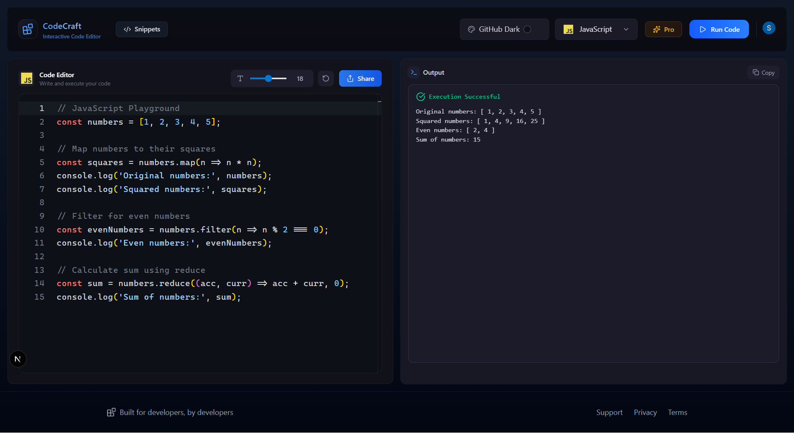
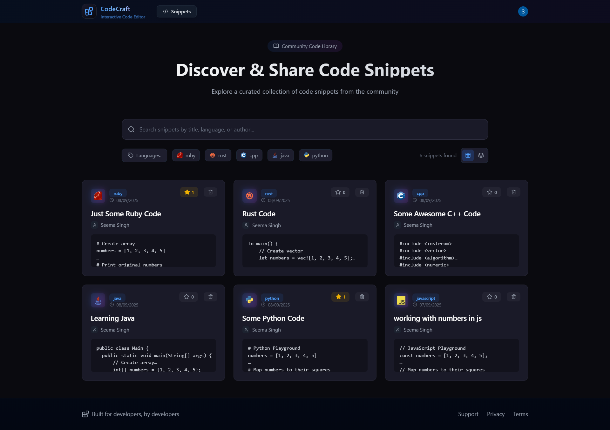
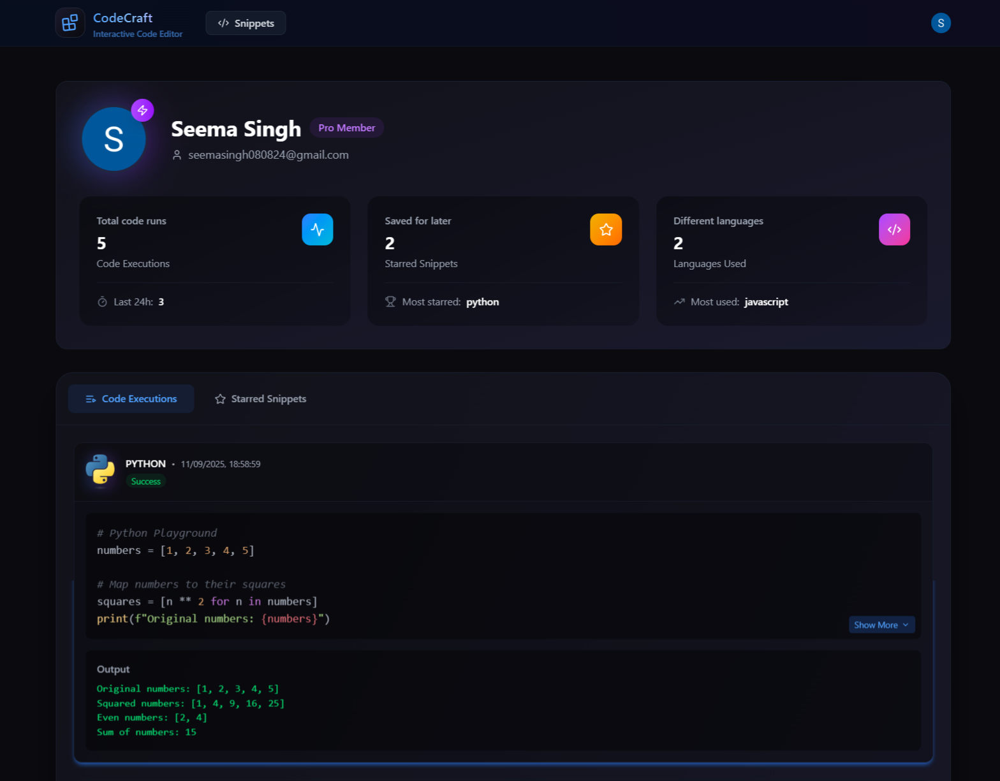

# 🚀 CodeCraft – Online IDE Inspired by VS Code  

🔗 **Live Demo:** [codecraft-saas.vercel.app](https://codecraft-saas.vercel.app/)  

CodeCraft is a **full-stack online IDE** inspired by Visual Studio Code. It allows users to **write, run, and share code snippets** in multiple programming languages with real-time collaboration. Featuring **authentication, payment integration, and modern UI/UX**, CodeCraft provides a seamless coding experience directly in the browser.  

---

## ✨ Features  

- 🔑 **User Authentication with Clerk**  
  Multi-provider login (Email, Google, GitHub) with secure session management.  

- 🗄️ **Real-time Database with Convex**  
  - Snippets, executions, comments, stars stored & synced in real-time.  
  - Indexed queries for lightning-fast retrieval.  

- 💻 **Powerful Online IDE**  
  - Monaco Editor (VS Code editor in the browser)  
  - Syntax highlighting, themes (Monokai, Solarized, GitHub Dark)  
  - Language & theme selector with Zustand state management  

- ⚡ **Run Code Securely**  
  - Execute snippets via **Piston API** in isolated Docker containers  
  - Supports multiple languages (JS, Python, C++, Go, Rust, etc.)  
  - Displays runtime & compilation errors  

- 🌐 **Community & Collaboration**  
  - Share snippets publicly or privately  
  - Real-time comments with Markdown + syntax highlighting  
  - Star & favorite snippets  

- 💳 **Monetization with Lemon Squeezy**  
  - Secure checkout & payment flow  
  - Webhook integration for subscription updates  
  - Unlock premium features & advanced languages  

- 🎨 **Modern UI/UX**  
  - TailwindCSS styling with Framer Motion animations  
  - Responsive, minimal, and aesthetic design  
  - Toast notifications with React Hot Toast  

- 🚀 **Deployment Ready**  
  - Hosted on **Vercel** with CI/CD  
  - Environment variable management  
  - Optimized for scalability  

---

## 🛠️ Tech Stack  

**Frontend:**  
- [Next.js 15](https://nextjs.org/) – React Framework  
- [TypeScript](https://www.typescriptlang.org/) – Static typing  
- [Tailwind CSS](https://tailwindcss.com/) – Utility-first styling  
- [Zustand](https://zustand-demo.pmnd.rs/) – State management  
- [Framer Motion](https://www.framer.com/motion/) – Animations  
- [Monaco Editor](https://microsoft.github.io/monaco-editor/) – Code editing  
- [Lucide Icons](https://lucide.dev/) – SVG icons  
- [React Hot Toast](https://react-hot-toast.com/) – Notifications  

**Backend & APIs:**  
- [Convex](https://convex.dev/) – Real-time DB + serverless functions  
- [Node.js](https://nodejs.org/) – Convex runtime environment  
- [Piston API](https://piston.rs/) – Code execution in Docker containers  

**Auth & Payments:**  
- [Clerk](https://clerk.dev/) – Authentication  
- [Lemon Squeezy](https://lemonsqueezy.com/) – Payment processing  

**Deployment:**  
- [Vercel](https://vercel.com/) – Hosting & CI/CD  

**Version Control:**  
- [GitHub](https://github.com/)  

---

## 📂 Project Structure  

```

codecraft/
├── public/              # Static assets
├── src/
│   ├── app/             # Next.js app router pages
│   │   ├── (auth)/      # Login / Register routes (Clerk)
│   │   ├── (dashboard)/ # Dashboard pages
│   │   ├── (snippets)/  # Snippet CRUD & details
│   │   └── api/         # API routes (webhooks, code execution)
│   ├── components/      # Reusable UI components
│   ├── hooks/           # Custom hooks
│   ├── lib/             # Utilities (db, auth, config)
│   ├── stores/          # Zustand stores
│   └── styles/          # Global Tailwind styles
└── convex/              # Convex backend schema & functions

````

---

## 🚀 Getting Started  

### 1️⃣ Clone the repository  

```bash
git clone https://github.com/your-username/codecraft.git
cd codecraft
````

### 2️⃣ Install dependencies

```bash
npm install
```

### 3️⃣ Set up environment variables

Create a `.env.local` file in the root directory and add:

```env
NEXT_PUBLIC_CLERK_FRONTEND_API=your_clerk_frontend_api
CLERK_API_KEY=your_clerk_api_key
CONVEX_DEPLOY_KEY=your_convex_deploy_key
PISTON_API_URL=https://emkc.org/api/v2/piston
LEMON_SQUEEZY_API_KEY=your_lemon_key
WEBHOOK_SECRET=your_webhook_secret
```

### 4️⃣ Run locally

```bash
npm run dev
```

Visit 👉 `http://localhost:3000`

---

## 📸 Screenshots  

| Home Page | Snippet Page |  
|-----------|--------------|  
|  |  |  

| Profile Page | Pricing Page  |  
|--------------|------------------------|  
|  |  |  


---

## 🤝 Contribution

1. Fork the repo
2. Create a new branch (`feature-xyz`)
3. Commit changes
4. Push to your branch
5. Open a Pull Request

---

## 📜 License

This project is licensed under the **MIT License**.

---

## 🙌 Acknowledgements

* [Visual Studio Code](https://code.visualstudio.com/) – Inspiration
* [Piston API](https://piston.rs/) – Code execution engine
* [Convex](https://convex.dev/), [Clerk](https://clerk.dev/), [Lemon Squeezy](https://lemonsqueezy.com/)

---

### 🔥 Built with ❤️ by [Saket Chaudhary](https://linkedin.com/in/saket-chaudhary22)
